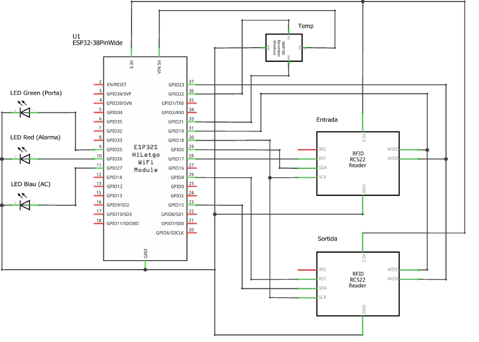
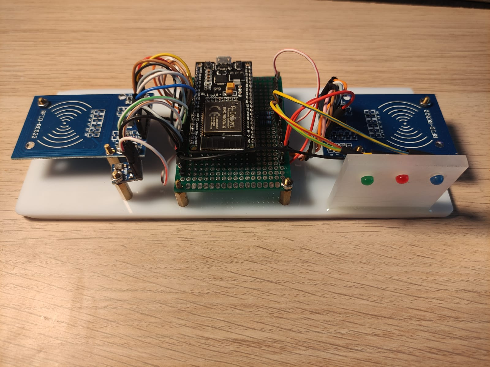

# Proyecto final

El proyecto va a tratar con datos de una "casa" (la temperatura y la entrada o salida de los participantes). Sabrá cuando alguien entra o sale de la casa a partir de unos lectores de tarjetas (MFRC522), sabremos la temperatura por el sensor de temperatura (BMP180).

Aquí tenemos el diagrama de bloques de nuestro proyecto:


Podemos observar que los lectores MMFRC522 se encuentran en el mismo bus SPI, los dos son slave y el procesados ESP32 se encarga de llevar la información que llega a los dos por partes separadas aun que el PIN MISO y MOSI vayan en serie (tienen el mismo PIN).

El sensor de temperatura será utilizado con un bus I2C que funciona también en modo slave y el master es el ESP32. 

Los 3 outputs son los LEDs encargados de que sepamos que funciona el programa. El led verde se enciende cada vez que se abre la puerta, el led azul cuando está activo el aire acondicionado y por úlitmo el led rojo significa que la tarjeta utilizada és incorrecta. Cada uno tiene su PIN a parte.

Aquí tenemos un circuito de como están estructurados los pines de cada tarjeta (hecho con la aplicación 'fritzing'):



---
## Montaje:



---
## Código:

```
using namespace std;

#include <Arduino.h>
#include <SPI.h> //llibreria pel bus SPI
#include <MFRC522.h> //llibreria pel lector de tags RFId (MFRC522)
#include <Wire.h> //llibreria pel bus I2C
#include <Adafruit_BMP085.h> //libreria pel sensor de temperatura

#define PIN_porta 25 //assignació del pin pel led que representa l'accés a la vivenda
#define PIN_alarma 26 //assignació del pin pel led que representa clau (tag) incorrecta
#define PIN_AC 27 //assignació del pin pel led que representa la activacio de l'aire acondicionat
#define RST_PIN_ent	17    //Pin 17 per el reset del RC522 dentrada
#define SS_PIN_ent	5  //Pin 5 per el SS (SDA o CS) del RC522 dentrada (slave select, chip select)
#define RST_PIN_sal 4 //""de sortida
#define SS_PIN_sal 15 //""de sortida
//pines para el sensor bmp180, SDA: 21, SCL:22
//SPI: miso 19 / mosi 23 / clk 18

float maxtemp = 22.0; //Aqui se define la temperatura a la cual se deberà activar el aire acondicionado
float tempactual;

bool estapapa = false;
bool estahijo = false;
bool hayalguien = false;
bool ACon = false;

MFRC522 mfrc522ent(SS_PIN_ent, RST_PIN_ent); //objecte per el RC522 d'entrada a la casa
MFRC522 mfrc522sal(SS_PIN_sal, RST_PIN_sal); //objecte per el RC522 de sortida de la casa

Adafruit_BMP085 bmp180; //objecte pel sensor de temperatura

byte IDtemp[4];//codi temporal per la lectura del tag
byte PAPA[4]= {0xE0, 0x0B, 0x92, 0x21};     
byte HIJO[4]= {0x50, 0x81, 0x35, 0x4E}; 
byte changetemp[4]= {0xE0, 0x40, 0xC2, 0x21};

void ACcontrol(void * parameter);

void registro_terminal (void * parameter);

bool compararIDs(byte *ID1, byte *ID2);

void opendoor();

void change_temp();

void triggeralarm();

void entraalguien (int quien){
  if(quien==0 && (not estapapa)){ //PAPA
    estapapa = true;
    opendoor();
  }
  else if(quien==2 && (not estahijo)){ //HIJO (2)
    estahijo = true;
    opendoor();
  }
}

void salealguien (int quien){
  if(quien==0 && estapapa){ //PAPA
    estapapa = false;
    opendoor();
    
  }
  else if(quien==2 && estahijo){ //HIJO (2)
    estahijo = false;
    opendoor();
  }
}

void setup() {
  Serial.begin(9600);

	SPI.begin();        //Iniciem el Bus SPI
	mfrc522ent.PCD_Init(); // Iniciem  els MFRC522
  mfrc522sal.PCD_Init();
  bmp180.begin();

  //definim el mode dels pins dels led com a OUTPUT i inicialitzem perque estiguin apagats
  pinMode(PIN_AC, OUTPUT); digitalWrite(PIN_AC, LOW);
  pinMode(PIN_porta, OUTPUT); digitalWrite(PIN_porta, LOW);
  pinMode(PIN_alarma, OUTPUT); digitalWrite(PIN_alarma, LOW);
  
  
  xTaskCreate(ACcontrol, "AC Control", 10000, NULL, 2, NULL); //prioridad 2, mas importante que la tarea de subida a la web
  xTaskCreate(registro_terminal, "Registro Terminal", 10000, NULL, 1, NULL);
  }

void loop() {
  // revisar si hay targetas "llave" en el lector de la entrada i comprovar si concuerda con la llave registrada del usuario
  if(mfrc522ent.PICC_IsNewCardPresent()){
    if(mfrc522ent.PICC_ReadCardSerial()){
      for(byte i=0; i<mfrc522ent.uid.size; i++){ //llegeix targeta present i guarda a "IDtemp"
        IDtemp[i]=mfrc522ent.uid.uidByte[i];
      }
      if(compararIDs(IDtemp, PAPA)){ //comparar amb els multiples membres de la familia en cas de tenir codis diferents
        entraalguien(0);
      }
      else if(compararIDs(IDtemp, HIJO)){
        entraalguien(2);
      }
      else if(compararIDs(IDtemp, changetemp)){
        change_temp();
      }
      else {
        triggeralarm();
      }
    }
  }
  //revisar si hay i comprovar targetas en el lector de salida de la casa
  if(mfrc522sal.PICC_IsNewCardPresent()){
    if(mfrc522sal.PICC_ReadCardSerial()){
      for(byte i=0; i<mfrc522sal.uid.size; i++){
        IDtemp[i]=mfrc522sal.uid.uidByte[i];
      }
      if(compararIDs(IDtemp, PAPA)){ //comparar amb els multiples membres de la familia 
        salealguien(0);
      }
      else if(compararIDs(IDtemp, HIJO)){
        salealguien(2);
      }
    }
  }
  hayalguien = estapapa or estahijo;
  delay(400); //delay para que puedan ejecutarse las tareas ACcontrol i registro_terminal
}

void ACcontrol(void * parameter){
  bool facalor;
  for(;;){
    tempactual = bmp180.readTemperature();
    if(tempactual < maxtemp)facalor = false;
    else facalor = true;
    if(hayalguien && facalor){
      ACon = true;
      digitalWrite(PIN_AC, HIGH);
      }
    else{
      ACon = false;
      digitalWrite(PIN_AC, LOW);
    }
  }
  vTaskDelete(NULL);
}

void registro_terminal (void * parameter){
  for(;;){
    if(!hayalguien)Serial.println("No hay nadie en casa aún. Por lo tanto el AC està desactivado.");
    else{
    Serial.println("En casa están:");
    if(estapapa)Serial.println("papa");
    if(estahijo)Serial.println("ninio");
    if(ACon)Serial.println("El aire acondicionado está activado.");
    else Serial.println("El aire acondicionado está desactivado.");
    }
    Serial.print("La temperatura ambiente és de: ");
    Serial.println(tempactual);
    Serial.print("El aire acondicionado se activarà cuando haya alguien en casa y la temperatura ambiente sea mayor que: ");
    Serial.println(maxtemp);
    Serial.println("________________________________");

    vTaskDelay(5000);
  }
  vTaskDelete(NULL);
}

void opendoor(){
    digitalWrite(PIN_porta, HIGH); 
    delay(1000); 
    digitalWrite(PIN_porta, LOW);
}

void change_temp(){
  if(maxtemp == 22.0)maxtemp = 40.0;
  else maxtemp = 22.0;
}

void triggeralarm(){
  digitalWrite(PIN_alarma, HIGH);
  delay(1000);
  digitalWrite(PIN_alarma, LOW);
}

bool compararIDs(byte ID1[], byte ID2[]){
  if(ID1[0] != ID2[0])return false;
  if(ID1[1] != ID2[1])return false;
  if(ID1[2] != ID2[2])return false;
  if(ID1[3] != ID2[3])return false;
  return true;
}
```
## Funcionamiento:

En la primera parte de código se pueden ver las librerias y la assignación de todos los pines.

```
using namespace std;

#include <Arduino.h>
#include <SPI.h> //llibreria pel bus SPI
#include <MFRC522.h> //llibreria pel lector de tags RFId (MFRC522)
#include <Wire.h> //llibreria pel bus I2C
#include <Adafruit_BMP085.h> //libreria pel sensor de temperatura

#define PIN_porta 25 //assignació del pin pel led que representa l'accés a la vivenda
#define PIN_alarma 26 //assignació del pin pel led que representa clau (tag) incorrecta
#define PIN_AC 27 //assignació del pin pel led que representa la activacio de l'aire acondicionat
#define RST_PIN_ent	17    //Pin 17 per el reset del RC522 dentrada
#define SS_PIN_ent	5  //Pin 5 per el SS (SDA o CS) del RC522 dentrada (slave select, chip select)
#define RST_PIN_sal 4 //""de sortida
#define SS_PIN_sal 15 //""de sortida
//pines para el sensor bmp180, SDA: 21, SCL:22
//SPI: miso 19 / mosi 23 / clk 18

```
